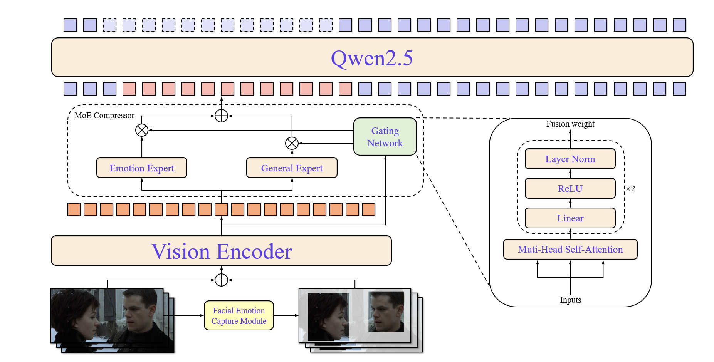

# Emotion-Qwen
Welcome to the official repository of Emotion-Qwen!



## Table of Contents

- [Emotion-Qwen](#emotion-qwen)
  - [News](#news)
  - [Environment Setup](#environment-setup)
  - [Inference](#inference)
  - [General Benchmark Evaluation](#general-benchmark-evaluation)
  - [Emotion Benchmark Evaluation](#emotion-benchmark-evaluation)
  - [Training](#training)
    - [Full Finetuning](#full-finetuning)
    - [Finetune with LoRA](#finetune-with-lora)
  - [License](#license)
  - [Citation](#citation)
  - [Acknowledgement](#acknowledgement)

## News
[2025.03.27] 🔥🔥🔥 We have released our code on Github.  
[2025.03.29] 🔥🔥🔥 We shared our pre-trained version of Emotion-Qwen on the Google Cloud Drive, follow this [link](https://drive.google.com/file/d/1o8A_NtKBKUzMGdLXvHSFQb-jaD4nxCf_/view?usp=sharing) to download.

## Detailed Example of Emotion-Qwen


## Environment Setup

Install the required packages using `environment.yaml`.


```bash
git clone https://github.com/24DavidHuang/Emotion-Qwen.git
cd ./EmotionQwen-main
conda env create -f environment.yaml
conda activate emotion_qwen

pip install flash-attn --no-build-isolation
```

**Note:** You should install flash-attn after installing the other packages.

## Inference

Check `EmotionQwen_infer.py` in path `./Emotion-Qwen/infer`. <br>


```python
from transformers import AutoModel, AutoTokenizer, AutoProcessor
from qwen_vl_utils import process_vision_info
import torch

model_dir="path/to/EmotionQwen"
video_path = "path/to/your/videos"
prompt = "Analyze the following video, combined with subtitles and visual clues, determine the emotional categories of the characters."

model = AutoModel.from_pretrained(
    model_dir,
    torch_dtype=torch.bfloat16,
    attn_implementation="flash_attention_2",
    device_map="auto",
    trust_remote_code=True,
)

# default processer
processor = AutoProcessor.from_pretrained(model_dir, trust_remote_code=True)

# if CUDA OOM, set max_pixels:

# max_pixels = 1280*28*28
# processor = AutoProcessor.from_pretrained(model_dir, max_pixels=max_pixels, trust_remote_code=True)

messages = [
    {
        "role": "user",
        "content": [
            {
                "type": "video",
                "video": f"file://{video_path}",
                "max_pixels": 448 * 448, # if CUDA OOM, lower this
                "fps": 1.0,
            },
            {"type": "text", "text": f"{prompt}"},
        ],
    }
]

text = processor.apply_chat_template(
    messages, tokenize=False, add_generation_prompt=True
)
image_inputs, video_inputs = process_vision_info(messages)
inputs = processor(
    text=[text],
    images=image_inputs,
    videos=video_inputs,
    padding=True,
    return_tensors="pt",
)
inputs = inputs.to("cuda")

generated_ids = model.generate(**inputs, max_new_tokens=1024)
generated_ids_trimmed = [
    out_ids[len(in_ids) :] for in_ids, out_ids in zip(inputs.input_ids, generated_ids)
]
output_text = processor.batch_decode(
    generated_ids_trimmed, skip_special_tokens=True, clean_up_tokenization_spaces=False
)
print(output_text)
```
## General Benchmark Evaluation
1. Visit the following link to download general benchmarks:

    + [MME](https://www.modelscope.cn/datasets/lmms-lab/MME)

    + [MMBench](https://www.modelscope.cn/datasets/lmms-lab/MMBench)

    + [POPE](https://www.modelscope.cn/datasets/lmms-lab/POPE)

    + [ScienceQA](https://www.modelscope.cn/datasets/swift/ScienceQA)

    + [SeedBench](https://www.modelscope.cn/datasets/lmms-lab/SEED-Bench)

    + [TextVQA](https://www.modelscope.cn/datasets/lmms-lab/textvqa)

    + [VQAv2](https://www.modelscope.cn/datasets/lmms-lab/VQAv2)


2. Open `general_benchmarks.yaml` and change the path to your downloaded benchmark and models.

```yaml
general_benchmarks.yaml:

datasets:

  - name: mmbench
    data_path: path/to/your/mmbench-en
    split: dev

# If you don't want to evaluate this benchmark, then annotate it:

#   - name: mme
#     data_path: path/to/your/MME 
#     split: test
  
models:

  - name: emotion_qwen
    model_path: /path/to/EmotionQwen

# If you don't want to evaluate this model, then annotate it:

#   - name: XXX
#     model_path: /xxx/xxx

```


3. Perform the following operations in the terminal to start the evaluation:

    ```bash
    cd ./EmotionQwen-main
    CUDA_VISIBLE_DEVICES=0 python -m general_benchmarks.evaluate --config general_benchmarks.yaml
    ```

4. The results will be stored in the `/EmotionQwen-main/logs` folder

## Emotion Benchmark Evaluation

### DFEW

1. Visit the following link to download the labels and raw videos for the DFEW dataset: [Dynamic Facial Expression in-the-Wild](https://dfew-dataset.github.io/download.html).

    Permission to use but not reproduce or distribute the DFEW database is granted to all researchers given that the following steps are properly followed:
    Send an E-mail to Xingxun Jiang(jiangxingxun@seu.edu.cn) and Yuan Zong(xhzongyuan@seu.edu.cn) before downloading the database. You will need a password to access the files of DFEW database.

2. Move `test(single-labeled)` file from origin DFEW dataset to the following directory:  `EmotionQwen-main/eval_data/DFEW/`
    `test(single-labeled)` contains 5 sets for five fold cross validation.

        test(single-labeled)/:
            --set_1.csv
            --set_2.csv
            --set_3.csv
            --set_4.csv
            --set_5.csv


3. Move DFEW videos to the following directory: `/home/dell/EmotionQwen-main/eval_data/DFEW/videos`

4. Run the `dfew_emotion_XXX.py` file corresponding to the model and generate DFEW evaluation results.

### MER2024

1. Visit the following link to download the labels and videos for the MER2024 Challenge: [MER2024 Challenge](https://zeroqiaoba.github.io/MER2024-website/).

    To download the dataset, please contact to merchallenge.contact@gmail.com.

2. Move `reference-noise.csv` and `reference-semi.csv` label files to the following directory:  `EmotionQwen-main/eval_data/MER2024/`

3. Move NOISE Track `MER2024_noise` videos to the following directory: `EmotionQwen-main/eval_data/MER2024/MER2024_noise/`
4. Move SEMI Track `MER2024_semi` videos to the following directory: `EmotionQwen-main/eval_data/MER2024/MER2024_semi/`
5. Visit the code `MER2024_XXX.py` file corresponding to the model, set `Track = "NOISE"` or `Track = "SEMI"` and generate MER2024 evaluation results.

## Training

**Note:** Deepspeed zero2 is faster than zero3, however it consumes more memory. Also, most of the time zero2 is more stable than zero3.<br><br>

To run the training script, use the following command:

### Full Finetuning

```bash
cd EmotionQwen-main/train
bash finetune_ds.sh
```


### Finetune with LoRA

```bash
cd EmotionQwen-main/train
bash finetune_lora.sh
```


<details>
<summary>Training arguments</summary>

- `--data_path` (str): Path to the formatted training data (a JSON file). **(Required)**
- `--image_folder` (str): Path to the images or videos folder as referenced in the formatted training data. **(Required)**
- `--model_name_or_path` (str): Path to the Emotion-Qwen model. **(Required)**
- `--use_liger` (bool): Option for using liger kernel to save memory.
- `--output_dir` (str): Output directory for model checkpoints
- `--num_train_epochs` (int): Number of training epochs (default: 1).
- `--per_device_train_batch_size` (int): Training batch size per GPU per forwarding step.
- `--gradient_accumulation_steps` (int): Gradient accumulation steps.
- `--tune_vision` (bool): Option to fine-tune vision_model.
- `--tune_llm` (bool): Option to fine-tune LLM.
- `--tune_general_compressor` (bool): Option to tune general_compressor.
- `--tune_emotion_compressor` (bool): Option to tune emotion_compressor.
- `--lora_enable` (bool): Option for using LoRA.
- `--lora_target_modules` (str): Target modules to add LoRA.
- `--learning_rate` (float): Learning rate for model.
- `--bf16` (bool): Option for using bfloat16.
- `--fp16` (bool): Option for using fp16.
- `--image_max_pixles` (int): Option for maximum maxmimum tokens for image.
- `--video_max_pixles` (int): Option for maximum maxmimum tokens for video.
- `--model_max_length` (int): Maximum sequence length.
- `--disable_flash_attn2` (bool): Disable Flash Attention 2.
- `--report_to` (str): Reporting tool (choices: 'tensorboard', 'wandb', 'none') (default: 'tensorboard').
- `--logging_dir` (str): Logging directory (default: "./tf-logs").
- `--logging_steps` (int): Logging steps (default: 1).
- `--dataloader_num_workers` (int): Number of data loader workers.

</details>

#### Merge LoRA Weights

The `finetune_ds.sh` or `finetune_lora.sh` will automatically implement Lora merging, if it fails, manually execute it:

```
cd EmotionQwen-main/train
python merge_lora.py
```

## License

This project is licensed under the Apache-2.0 License. See the [LICENSE](LICENSE) file for details.

<!-- ## Citation

If you find Emotion-Qwen useful to you, please consider giving a :star: and citing:

```bibtex
@misc{huang2025emotionqwentraininghybridexperts,
      title={Emotion-Qwen: Training Hybrid Experts for Unified Emotion and General Vision-Language Understanding}, 
      author={Dawei Huang and Qing Li and Chuan Yan and Zebang Cheng and Yurong Huang and Xiang Li and Bin Li and Xiaohui Wang and Zheng Lian and Xiaojiang Peng},
      year={2025},
      eprint={2505.06685},
      archivePrefix={arXiv},
      primaryClass={cs.MM},
      url={https://arxiv.org/abs/2505.06685}, 
}
``` -->

## Acknowledgement

Build on: [QwenLM](https://github.com/QwenLM/Qwen2.5-VL), [MiniCPM-V](https://github.com/OpenBMB/MiniCPM-o), [Qwen2-VL-Finetuning](https://github.com/2U1/Qwen2-VL-Finetune), [Otter](https://github.com/EvolvingLMMs-Lab/Otter).
